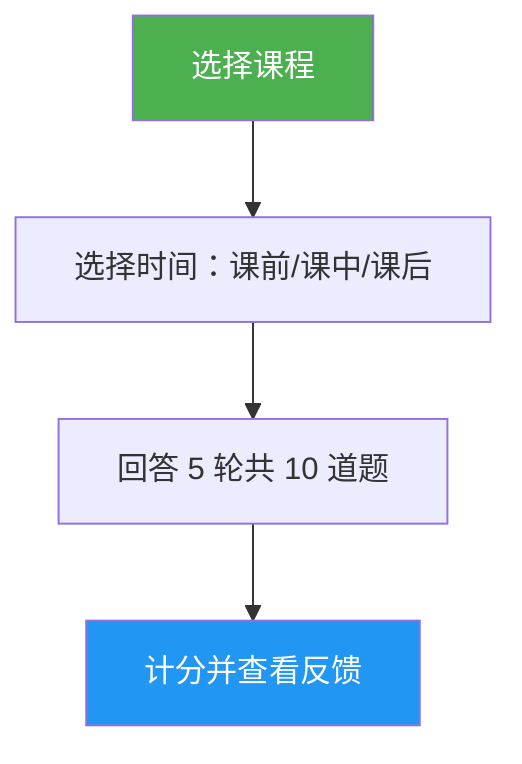

# Lesson Quiz

> 交互式测验，通过 10 道题目测试你对特定 Claude Code 课程的理解，提供每题反馈和针对性复习指导。

## 亮点

- 每课 10 道题目，涵盖概念理解和实际应用
- 覆盖全部 10 课（01-Slash Commands 到 10-CLI）
- 三种时间模式：预习测试、进度检查或掌握验证
- 每题配有正确答案及解释
- 针对性复习建议，指向课程具体章节
- 全部课程的 100 道题库位于 `references/question-bank.md`

## 使用场景

| 这样说... | 技能将... |
|---|---|
| "quiz me on hooks" | 运行关于第 06 课：Hooks 的 10 题测验 |
| "lesson quiz 03" | 测试你对第 03 课：Skills 的掌握 |
| "do I understand MCP" | 评估你对第 05 课：MCP 的理解 |
| "practice quiz" | 让你选择课程，然后进行测验 |

## 工作原理



## 使用方法

```
/lesson-quiz [课程名称或编号]
```

示例：
```
/lesson-quiz hooks
/lesson-quiz 03
/lesson-quiz advanced-features
/lesson-quiz           # （提示选择课程）
```

## 输出内容

### 成绩报告
- 总分 10 分及等级（Mastered / Proficient / Developing / Beginning）
- 按题目类别（概念 vs 实践）分类

### 每题反馈
对于每道错题：
- 你的答案 vs 正确答案
- 解释为什么正确答案正确
- 需要复习的课程具体章节

### 时间感知的指导
- **课前**：建立基线，突出学习期间需要专注的领域
- **课中**：识别已掌握的内容和需要回顾的部分
- **课后**：确认掌握程度或找出剩余差距

## 资源

| 路径 | 描述 |
|---|---|
| `references/question-bank.md` | 100 道预选题库（每课 10 题），含答案、解释和复习指针 |
