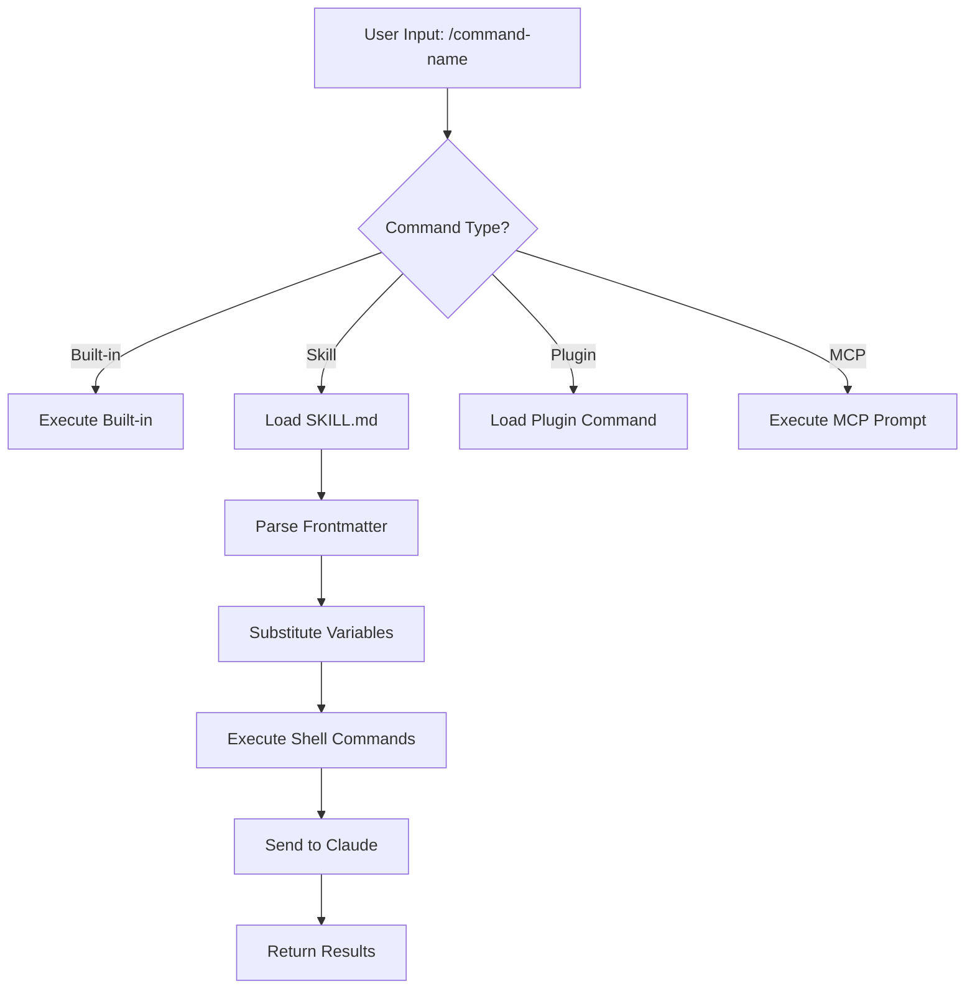
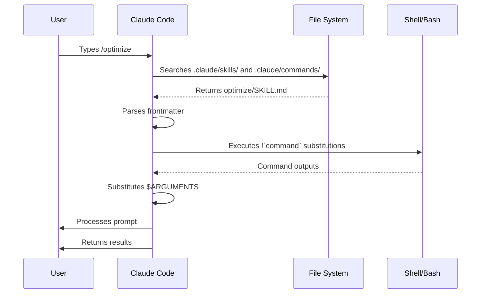

<picture>
  <source media="(prefers-color-scheme: dark)" srcset="../resources/logos/claude-howto-logo-dark.svg">
  
</picture>

# 斜杠命令

## 概述

斜杠命令是控制 Claude 在交互会话中行为的快捷方式，分为以下几种类型：

- **内置命令**：Claude Code 自带（`/help`、`/clear`、`/model`）
- **Skills**：以 `SKILL.md` 文件形式创建的用户自定义命令（`/optimize`、`/pr`）
- **插件命令**：来自已安装插件的命令（`/frontend-design:frontend-design`）
- **MCP prompts**：来自 MCP servers 的命令（`/mcp__github__list_prs`）

> **注意**：自定义斜杠命令已合并到 skills。`.claude/commands/` 下的文件仍然能用，但 skills（`.claude/skills/`）是现在推荐的方式。两者都创建 `/命令名` 快捷方式。详见 [Skills 指南](../03-skills/)。

## 内置命令参考

内置命令是常见操作的快捷方式。共有 **55+ 个内置命令**和 **5 个捆绑 skills**。在 Claude Code 里输入 `/` 可查看完整列表，输入 `/` 加任意字母可过滤。

| 命令 | 用途 |
|---------|---------|
| `/add-dir <path>` | 添加工作目录 |
| `/agents` | 管理 agent 配置 |
| `/branch [name]` | 分支对话到新会话（别名：`/fork`）。注意：v2.1.77 起 `/fork` 改名为 `/branch` |
| `/btw <question>` | 提问但不加入历史记录 |
| `/chrome` | 配置 Chrome 浏览器集成 |
| `/clear` | 清除对话（别名：`/reset`、`/new`） |
| `/color [color\|default]` | 设置提示条颜色 |
| `/compact [instructions]` | 压缩对话，可选带聚焦指令 |
| `/config` | 打开设置（别名：`/settings`） |
| `/context` | 将上下文使用情况可视化为彩色网格 |
| `/copy [N]` | 将助手回复复制到剪贴板；`w` 写入文件 |
| `/cost` | 显示 token 使用统计 |
| `/desktop` | 在桌面应用继续（别名：`/app`） |
| `/diff` | 未提交更改的交互式 diff 查看器 |
| `/doctor` | 诊断安装健康状况 |
| `/effort [low\|medium\|high\|max\|auto]` | 设置努力级别。`max` 需要 Opus 4.6 |
| `/exit` | 退出 REPL（别名：`/quit`） |
| `/export [filename]` | 将当前对话导出到文件或剪贴板 |
| `/extra-usage` | 为速率限制配置额外用量 |
| `/fast [on\|off]` | 切换快速模式 |
| `/feedback` | 提交反馈（别名：`/bug`） |
| `/help` | 显示帮助 |
| `/hooks` | 查看 hook 配置 |
| `/ide` | 管理 IDE 集成 |
| `/init` | 初始化 `CLAUDE.md`。设置 `CLAUDE_CODE_NEW_INIT=true` 可进入交互流程 |
| `/insights` | 生成会话分析报告 |
| `/install-github-app` | 设置 GitHub Actions 应用 |
| `/install-slack-app` | 安装 Slack 应用 |
| `/keybindings` | 打开快捷键配置 |
| `/login` | 切换 Anthropic 账号 |
| `/logout` | 登出 Anthropic 账号 |
| `/mcp` | 管理 MCP servers 和 OAuth |
| `/memory` | 编辑 `CLAUDE.md`，切换自动记忆 |
| `/mobile` | 移动应用的二维码（别名：`/ios`、`/android`） |
| `/model [model]` | 用左右箭头选择模型和努力级别 |
| `/passes` | 分享一周免费 Claude Code |
| `/permissions` | 查看/更新权限（别名：`/allowed-tools`） |
| `/plan [description]` | 进入规划模式 |
| `/plugin` | 管理插件 |
| `/pr-comments [PR]` | 获取 GitHub PR 评论 |
| `/privacy-settings` | 隐私设置（仅 Pro/Max） |
| `/release-notes` | 查看更新日志 |
| `/reload-plugins` | 重新加载活动插件 |
| `/remote-control` | 从 claude.ai 远程控制（别名：`/rc`） |
| `/remote-env` | 配置默认远程环境 |
| `/rename [name]` | 重命名会话 |
| `/resume [session]` | 恢复对话（别名：`/continue`） |
| `/review` | **已弃用** — 请安装 `code-review` 插件代替 |
| `/rewind` | 回溯对话和/或代码（别名：`/checkpoint`） |
| `/sandbox` | 切换沙盒模式 |
| `/schedule [description]` | 创建/管理计划任务 |
| `/security-review` | 分析分支的安全漏洞 |
| `/skills` | 列出可用 skills |
| `/stats` | 可视化每日用量、会话数、连续天数 |
| `/status` | 显示版本、模型、账号 |
| `/statusline` | 配置状态栏 |
| `/tasks` | 列出/管理后台任务 |
| `/terminal-setup` | 配置终端快捷键 |
| `/theme` | 更改颜色主题 |
| `/vim` | 切换 Vim/普通模式 |
| `/voice` | 切换按键说话语音输入 |

### 捆绑的 Skills

这些 skills 随 Claude Code 附带，像斜杠命令一样调用：

| Skill | 用途 |
|-------|---------|
| `/batch <instruction>` | 使用 worktrees 编排大规模并行更改 |
| `/claude-api` | 为项目语言加载 Claude API 参考 |
| `/debug [description]` | 启用调试日志 |
| `/loop [interval] <prompt>` | 按间隔重复运行 prompt |
| `/simplify [focus]` | 审查已更改文件的代码质量 |

### 已弃用的命令

| 命令 | 状态 |
|---------|--------|
| `/review` | 已弃用 — 由 `code-review` 插件替代 |
| `/output-style` | v2.1.73 起已弃用 |
| `/fork` | 改名为 `/branch`（别名仍然可用，v2.1.77） |

### 最新变更

- `/fork` 改名为 `/branch`，保留 `/fork` 作为别名（v2.1.77）
- `/output-style` 已弃用（v2.1.73）
- `/review` 已弃用，改用 `code-review` 插件
- 新增 `/effort` 命令，`max` 级别需要 Opus 4.6
- 新增 `/voice` 命令用于按键说话语音输入
- 新增 `/schedule` 命令用于创建/管理计划任务
- 新增 `/color` 命令用于提示条自定义
- `/model` 选择器现在显示人类可读的标签（如 "Sonnet 4.6"）而非原始模型 ID
- `/resume` 支持 `/continue` 别名
- MCP prompts 可作为 `/mcp__<server>__<prompt>` 命令使用（见 [MCP Prompts 作为命令](#mcp-prompts-作为命令)）

## 自定义命令（现为 Skills）

自定义斜杠命令已**合并到 skills**。两种方式都创建以 `/命令名` 调用的命令：

| 方式 | 位置 | 状态 |
|----------|----------|--------|
| **Skills（推荐）** | `.claude/skills/<name>/SKILL.md` | 当前标准 |
| **旧版 Commands** | `.claude/commands/<name>.md` | 仍然可用 |

如果 skill 和 command 同名，**skill 优先**。例如，当 `.claude/commands/review.md` 和 `.claude/skills/review/SKILL.md` 同时存在时，使用 skill 版本。

### 迁移路径

现有的 `.claude/commands/` 文件无需更改即可继续工作。迁移到 skills：

**之前（Command）：**
```
.claude/commands/optimize.md
```

**之后（Skill）：**
```
.claude/skills/optimize/SKILL.md
```

### 为什么用 Skills？

Skills 比旧版 commands 提供更多功能：

- **目录结构**：可打包脚本、模板和参考文件
- **自动调用**：Claude 可在相关时自动触发 skills
- **调用控制**：选择用户、Claude 或两者都可以调用
- **Subagent 执行**：用 `context: fork` 在隔离上下文中运行
- **渐进披露**：只在需要时加载额外文件

### 创建自定义 Skill 命令

创建带 `SKILL.md` 文件的目录：

```bash
mkdir -p .claude/skills/my-command
```

**文件：** `.claude/skills/my-command/SKILL.md`

```yaml
---
name: my-command
description: 这个命令做什么，以及何时使用
---

# My Command

调用此命令时 Claude 遵循的指令。

1. 第一步
2. 第二步
3. 第三步
```

### Frontmatter 参考

| 字段 | 用途 | 默认值 |
|-------|---------|---------|
| `name` | 命令名（成为 `/name`） | 目录名 |
| `description` | 简短描述（帮助 Claude 知道何时使用） | 第一段 |
| `argument-hint` | 自动补全期望的参数 | 无 |
| `allowed-tools` | 命令可无权限使用的工具 | 继承 |
| `model` | 使用的特定模型 | 继承 |
| `disable-model-invocation` | 若为 `true`，仅用户可调用（非 Claude） | `false` |
| `user-invocable` | 若为 `false`，在 `/` 菜单中隐藏 | `true` |
| `context` | 设为 `fork` 以在隔离 subagent 中运行 | 无 |
| `agent` | 使用 `context: fork` 时的 agent 类型 | `general-purpose` |
| `hooks` | Skill 作用域的 hooks（PreToolUse、PostToolUse、Stop） | 无 |

### 参数

命令可以接收参数：

**用 `$ARGUMENTS` 接收所有参数：**

```yaml
---
name: fix-issue
description: 按编号修复 GitHub issue
---

按照我们的编码规范修复 #$ARGUMENTS
```

用法：`/fix-issue 123` → `$ARGUMENTS` 变为 "123"

**用 `$0`、`$1` 等接收单独参数：**

```yaml
---
name: review-pr
description: 按优先级审查 PR
---

按优先级 $1 审查 PR #$0
```

用法：`/review-pr 456 high` → `$0`="456", `$1`="high"

### 动态上下文（Shell 命令）

用 ``!`command` `` 在 prompt 前执行 bash 命令：

```yaml
---
name: commit
description: 创建带上下文的 git 提交
allowed-tools: Bash(git *)
---

## 上下文

- 当前 git 状态：!`git status`
- 当前 git diff：!`git diff HEAD`
- 当前分支：!`git branch --show-current`
- 最近提交：!`git log --oneline -5`

## 你的任务

根据以上更改，创建单个 git 提交。
```

### 文件引用

用 `@` 包含文件内容：

```markdown
审查 @src/utils/helpers.js 中的实现
对比 @src/old-version.js 和 @src/new-version.js
```

## 插件命令

插件可以提供自定义命令：

```
/plugin-name:command-name
```

或者当没有命名冲突时直接用 `/command-name`。

**示例：**
```bash
/frontend-design:frontend-design
/commit-commands:commit
```

## MCP Prompts 作为命令

MCP servers 可以将 prompts 暴露为斜杠命令：

```
/mcp__<server-name>__<prompt-name> [arguments]
```

**示例：**
```bash
/mcp__github__list_prs
/mcp__github__pr_review 456
/mcp__jira__create_issue "Bug title" high
```

### MCP 权限语法

在权限中控制 MCP server 访问：

- `mcp__github` — 访问整个 GitHub MCP server
- `mcp__github__*` — 通配符访问所有工具
- `mcp__github__get_issue` — 特定工具访问

## 命令架构



## 命令生命周期



## 本目录中的可用命令

这些示例命令可作为 skills 或旧版 commands 安装。

### 1. `/optimize` - 代码优化

分析代码的性能问题、内存泄漏和优化机会。

**用法：**
```
/optimize
[Paste your code]
```

### 2. `/pr` - Pull Request 准备

引导完成 PR 准备清单，包括 linting、测试和提交格式。

**用法：**
```
/pr
```

**截图：**


### 3. `/generate-api-docs` - API 文档生成器

从源代码生成全面的 API 文档。

**用法：**
```
/generate-api-docs
```

### 4. `/commit` - 带上下文的 Git 提交

从仓库获取动态上下文创建 git 提交。

**用法：**
```
/commit [optional message]
```

### 5. `/push-all` - Stage、提交并推送

Stage 所有更改，创建提交，推送到远程，并进行安全检查。

**用法：**
```
/push-all
```

**安全检查：**
- 密钥：`.env*`、`*.key`、`*.pem`、`credentials.json`
- API Keys：检测真实密钥 vs 占位符
- 大文件：`>10MB` 且无 Git LFS
- 构建产物：`node_modules/`、`dist/`、`__pycache__/`

### 6. `/doc-refactor` - 文档重构

重构项目文档结构，提升清晰度和可访问性。

**用法：**
```
/doc-refactor
```

### 7. `/setup-ci-cd` - CI/CD 流水线设置

实现 pre-commit hooks 和 GitHub Actions 进行质量保证。

**用法：**
```
/setup-ci-cd
```

### 8. `/unit-test-expand` - 测试覆盖率扩展

针对未测试的分支和边界情况提高测试覆盖率。

**用法：**
```
/unit-test-expand
```

## 安装

### 作为 Skills（推荐）

复制到 skills 目录：

```bash
# 创建 skills 目录
mkdir -p .claude/skills

# 对每个命令文件，创建 skill 目录
for cmd in optimize pr commit; do
  mkdir -p .claude/skills/$cmd
  cp 01-slash-commands/$cmd.md .claude/skills/$cmd/SKILL.md
done
```

### 作为旧版 Commands

复制到 commands 目录：

```bash
# 项目范围（团队）
mkdir -p .claude/commands
cp 01-slash-commands/*.md .claude/commands/

# 个人使用
mkdir -p ~/.claude/commands
cp 01-slash-commands/*.md ~/.claude/commands/
```

## 创建你自己的命令

### Skill 模板（推荐）

创建 `.claude/skills/my-command/SKILL.md`：

```yaml
---
name: my-command
description: 这个命令做什么。使用条件是 [触发条件]。
argument-hint: [optional-args]
allowed-tools: Bash(npm *), Read, Grep
---

# Command Title

## 上下文

- 当前分支：!`git branch --show-current`
- 相关文件：@package.json

## 指令

1. 第一步
2. 第二步，带参数：$ARGUMENTS
3. 第三步

## 输出格式

- 如何格式化响应
- 包含什么
```

### 仅用户可调用的命令（无自动调用）

对于有副作用、Claude 不应自动触发的命令：

```yaml
---
name: deploy
description: 部署到生产环境
disable-model-invocation: true
allowed-tools: Bash(npm *), Bash(git *)
---

将应用部署到生产环境：

1. 运行测试
2. 构建应用
3. 推送到部署目标
4. 验证部署
```

## 最佳实践

| 应该 | 不应该 |
|------|---------|
| 使用清晰、以动作为导向的名称 | 为一次性任务创建命令 |
| 包含带触发条件的 `description` | 在命令中构建复杂逻辑 |
| 保持命令专注于单一任务 | 硬编码敏感信息 |
| 对副作用使用 `disable-model-invocation` | 跳过 description 字段 |
| 用 `!` 前缀获取动态上下文 | 假设 Claude 知道当前状态 |
| 在 skill 目录中组织相关文件 | 把所有东西放在一个文件里 |

## 故障排查

### 命令找不到

**解决方案：**
- 检查文件是否在 `.claude/skills/<name>/SKILL.md` 或 `.claude/commands/<name>.md`
- 验证 frontmatter 中的 `name` 字段与预期命令名匹配
- 重启 Claude Code 会话
- 运行 `/help` 查看可用命令

### 命令执行不符合预期

**解决方案：**
- 添加更具体的指令
- 在 skill 文件中包含示例
- 检查 `allowed-tools`（如果使用 bash 命令）
- 先用简单输入测试

### Skill vs Command 冲突

如果两者同名，**skill 优先**。删除其中一个或重命名。

## 相关指南

- **[Skills](../03-skills/)** — skills 完整参考（自动调用的能力）
- **[Memory](../02-memory/)** — 用 CLAUDE.md 持久化上下文
- **[Subagents](../04-subagents/)** — 委托的 AI agents
- **[插件](../07-plugins/)** — 打包的命令集合
- **[Hooks](../06-hooks/)** — 事件驱动的自动化

## 更多资源

- [官方交互模式文档](https://code.claude.com/docs/en/interactive-mode) — 内置命令参考
- [官方 Skills 文档](https://code.claude.com/docs/en/skills) — 完整 skills 参考
- [CLI 参考](https://code.claude.com/docs/en/cli-reference) — 命令行选项

---

*属于 [Claude How To](../) 指南系列*
