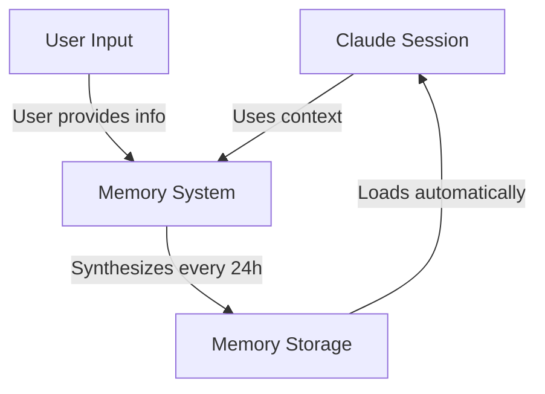
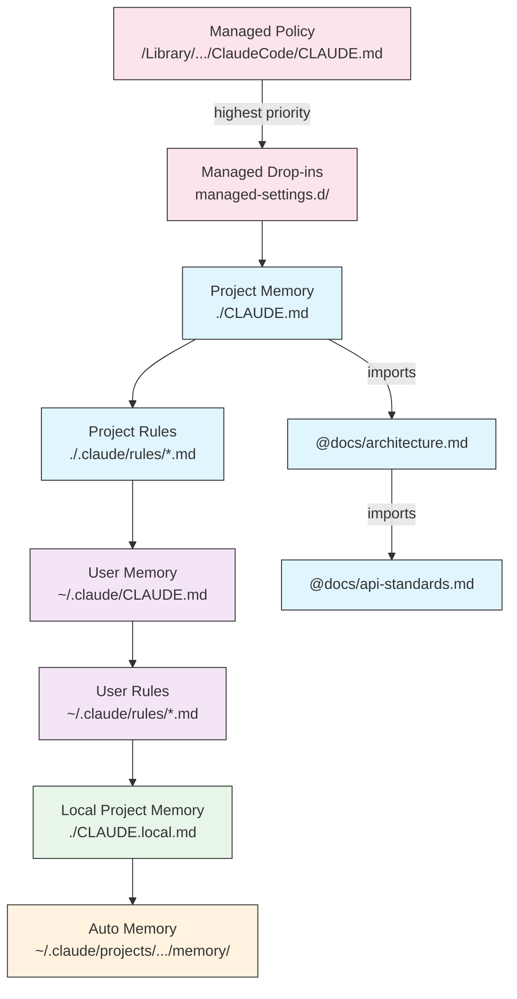
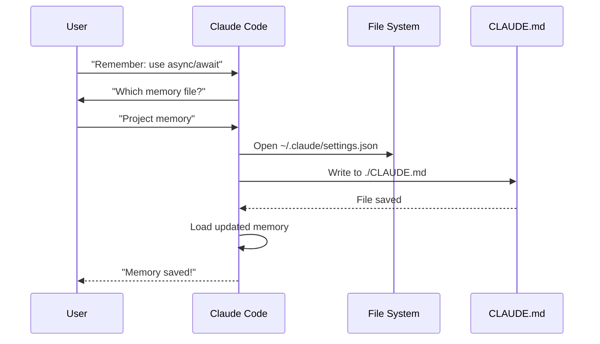
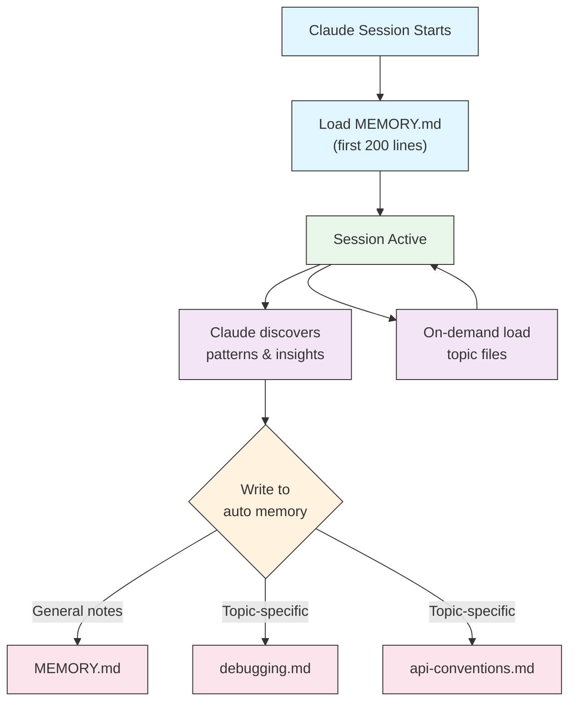

<picture>
  <source media="(prefers-color-scheme: dark)" srcset="../resources/logos/claude-howto-logo-dark.svg">
  
</picture>

# Memory 指南

Memory 让 Claude 能够在会话和对话之间保留上下文。它有两种形式：claude.ai 中的自动综合，以及 Claude Code 中基于文件系统的 CLAUDE.md。

## 概述

Claude Code 中的 Memory 提供了跨多个会话和对话持久化的上下文。与临时上下文窗口不同，memory 文件允许你：

- 在团队中共享项目标准
- 存储个人开发偏好
- 维护特定目录的规则和配置
- 导入外部文档
- 作为项目的一部分对 memory 进行版本控制

Memory 系统在多个层级运作，从全局个人偏好到特定子目录，允许对 Claude 记住什么以及如何应用这些知识进行细粒度控制。

## Memory 命令快速参考

| 命令 | 用途 | 用法 | 何时使用 |
|---------|---------|-------|-------------|
| `/init` | 初始化项目 memory | `/init` | 启动新项目、首次 CLAUDE.md 设置 |
| `/memory` | 在编辑器中编辑 memory 文件 | `/memory` | 大量更新、重构、审查内容 |
| `#` 前缀 | 快速单行添加 memory | `# 你的规则` | 在对话中快速添加规则 |
| `# new rule into memory` | 显式添加 memory | `# new rule into memory<br/>你的详细规则` | 添加复杂的多行规则 |
| `# remember this` | 自然语言 memory | `# remember this<br/>你的指令` | 对话中的 memory 更新 |
| `@path/to/file` | 导入外部内容 | `@README.md` 或 `@docs/api.md` | 在 CLAUDE.md 中引用现有文档 |

## 快速入门：初始化 Memory

### `/init` 命令

`/init` 命令是在 Claude Code 中设置项目 memory 最快的方式。它用基础项目文档初始化 CLAUDE.md 文件。

**用法：**

```bash
/init
```

**作用：**

- 在项目中创建新的 CLAUDE.md 文件（通常在 `./CLAUDE.md` 或 `./.claude/CLAUDE.md`）
- 建立项目约定和指南
- 为跨会话的上下文持久化奠定基础
- 提供记录项目标准的模板结构

**增强的交互模式：** 设置 `CLAUDE_CODE_NEW_INIT=true` 可启用多阶段交互流程，逐步引导你完成项目设置：

```bash
CLAUDE_CODE_NEW_INIT=true claude
/init
```

**何时使用 `/init`：**

- 用 Claude Code 启动新项目
- 建立团队编码标准和约定
- 创建关于代码库结构的文档
- 为协作开发设置 memory 层级

**示例工作流：**

```markdown
# 在你的项目目录中
/init

# Claude 创建 CLAUDE.md，结构类似：
# 项目配置
## 项目概览
- 名称：你的项目
- 技术栈：[你的技术]
- 团队规模：[开发者数量]

## 开发标准
- 代码风格偏好
- 测试要求
- Git 工作流约定
```

### 用 `#` 快速更新 Memory

你可以在任何对话期间通过以 `#` 开头快速向 memory 添加信息：

**语法：**

```markdown
# 你的 memory 规则或指令
```

**示例：**

```markdown
# 在这个项目中始终使用 TypeScript strict 模式

# 优先使用 async/await 而非 promise 链

# 每次提交前运行 npm test

# 文件名使用 kebab-case
```

**原理：**

1. 用 `#` 后跟你的规则开始消息
2. Claude 识别这是 memory 更新请求
3. Claude 询问更新到哪个 memory 文件（项目或个人）
4. 规则被添加到相应的 CLAUDE.md 文件
5. 未来会话自动加载此上下文

**替代模式：**

```markdown
# new rule into memory
在这个项目中始终使用 Zod schema 验证用户输入

# remember this
所有版本发布使用语义化版本

# add to memory
数据库迁移必须是可逆的
```

### `/memory` 命令

`/memory` 命令提供直接访问，在 Claude Code 会话中编辑你的 CLAUDE.md memory 文件。它在你的系统编辑器中打开 memory 文件。

**用法：**

```bash
/memory
```

**作用：**

- 在系统默认编辑器中打开 memory 文件
- 允许进行大量添加、修改和重构
- 提供对层级中所有 memory 文件的直接访问
- 使你能够管理跨会话的持久化上下文

**何时使用 `/memory`：**

- 审查现有 memory 内容
- 对项目标准进行大量更新
- 重构 memory 结构
- 添加详细文档或指南
- 随着项目发展维护和更新 memory

**对比：`/memory` vs `/init`**

| 方面 | `/memory` | `/init` |
|--------|-----------|---------|
| **用途** | 编辑现有 memory 文件 | 初始化新的 CLAUDE.md |
| **何时使用** | 更新/修改项目上下文 | 启动新项目 |
| **操作** | 打开编辑器进行更改 | 生成起始模板 |
| **工作流** | 持续维护 | 一次性设置 |

**示例工作流：**

```markdown
# 打开 memory 进行编辑
/memory

# Claude 呈现选项：
# 1. Managed Policy Memory
# 2. Project Memory (./CLAUDE.md)
# 3. User Memory (~/.claude/CLAUDE.md)
# 4. Local Project Memory

# 选择选项 2（Project Memory）
# 你的默认编辑器用 ./CLAUDE.md 内容打开

# 进行更改，保存，然后关闭编辑器
# Claude 自动重新加载更新后的 memory
```

**使用 Memory 导入：**

CLAUDE.md 文件支持 `@path/to/file` 语法来包含外部内容：

```markdown
# 项目文档
项目概览见 @README.md
可用 npm 命令见 @package.json
系统设计见 @docs/architecture.md

# 使用绝对路径从主目录导入
@~/.claude/my-project-instructions.md
```

**导入功能：**

- 支持相对路径和绝对路径（例如 `@docs/api.md` 或 `@~/.claude/my-project-instructions.md`）
- 支持递归导入，最大深度为 5
- 首次从外部位置导入会触发安全审批对话框
- 导入指令不在 markdown 代码跨距或代码块内求值（因此在示例中记录它们是安全的）
- 通过引用现有文档帮助避免重复
- 自动将引用内容包含在 Claude 的上下文中

## Memory 架构

Claude Code 中的 Memory 遵循分层系统，不同作用域服务不同目的：



## Claude Code 中的 Memory 层级

Claude Code 使用多级分层 memory 系统。Memory 文件在 Claude Code 启动时自动加载，较高层级的优先。

**完整 Memory 层级（按优先级顺序）：**

1. **Managed Policy** - 全组织指令
   - macOS: `/Library/Application Support/ClaudeCode/CLAUDE.md`
   - Linux/WSL: `/etc/claude-code/CLAUDE.md`
   - Windows: `C:\Program Files\ClaudeCode\CLAUDE.md`

2. **Managed Drop-ins** - 按字母顺序合并的策略文件（v2.1.83+）
   - `managed-settings.d/` 目录，与 managed policy CLAUDE.md 并列
   - 文件按字母顺序合并，用于模块化策略管理

3. **Project Memory** - 团队共享上下文（版本控制）
   - `./.claude/CLAUDE.md` 或 `./CLAUDE.md`（在仓库根目录）

4. **Project Rules** - 模块化、主题特定的项目指令
   - `./.claude/rules/*.md`

5. **User Memory** - 个人偏好（所有项目）
   - `~/.claude/CLAUDE.md`

6. **User-Level Rules** - 个人规则（所有项目）
   - `~/.claude/rules/*.md`

7. **Local Project Memory** - 个人项目特定偏好
   - `./CLAUDE.local.md`

> **注意**：`CLAUDE.local.md` 在 2026 年 3 月的[官方文档](https://code.claude.com/docs/en/memory)中未提及。它可能仍作为遗留功能使用。对于新项目，考虑使用 `~/.claude/CLAUDE.md`（用户级）或 `.claude/rules/`（项目级、路径作用域）。

8. **Auto Memory** - Claude 自动记录笔记和学习
   - `~/.claude/projects/<project>/memory/`

**Memory 发现行为：**

Claude 按此顺序搜索 memory 文件，较早的位置优先级更高：



## 用 `claudeMdExcludes` 排除 CLAUDE.md 文件

在大型 monorepo 中，某些 CLAUDE.md 文件可能与你的当前工作无关。`claudeMdExcludes` 设置允许你跳过特定的 CLAUDE.md 文件，使其不加载到上下文中：

```jsonc
// 在 ~/.claude/settings.json 或 .claude/settings.json
{
  "claudeMdExcludes": [
    "packages/legacy-app/CLAUDE.md",
    "vendors/**/CLAUDE.md"
  ]
}
```

模式与项目根目录的相对路径匹配。这特别适合：

- 有多个子项目的大型 monorepo，其中只有部分相关
- 包含 vendored 或第三方 CLAUDE.md 文件的仓库
- 通过排除过时或不相关的指令来减少 Claude 上下文窗口中的噪音

## 设置文件层级

Claude Code 设置（包括 `autoMemoryDirectory`、`claudeMdExcludes` 和其他配置）从五级层级解析，较高层级优先级更高：

| 层级 | 位置 | 作用域 |
|-------|----------|---------|
| 1（最高） | Managed policy（系统级） | 全组织强制 |
| 2 | `managed-settings.d/`（v2.1.83+） | 模块化策略 drop-ins，按字母合并 |
| 3 | `~/.claude/settings.json` | 用户偏好 |
| 4 | `.claude/settings.json` | 项目级（提交到 git） |
| 5（最低） | `.claude/settings.local.json` | 本地覆盖（git 忽略） |

**平台特定配置（v2.1.51+）：**

设置也可以通过以下方式配置：
- **macOS**：属性列表（plist）文件
- **Windows**：Windows 注册表

这些平台原生机制与 JSON 设置文件一起读取，并遵循相同的优先级规则。

## 模块化规则系统

使用 `.claude/rules/` 目录结构创建有组织的、路径特定的规则。规则可以在项目级和用户级定义：

```
your-project/
├── .claude/
│   ├── CLAUDE.md
│   └── rules/
│       ├── code-style.md
│       ├── testing.md
│       ├── security.md
│       └── api/                  # 支持子目录
│           ├── conventions.md
│           └── validation.md

~/.claude/
├── CLAUDE.md
└── rules/                        # 用户级规则（所有项目）
    ├── personal-style.md
    └── preferred-patterns.md
```

规则在 `rules/` 目录中被递归发现，包括任何子目录。用户级规则在 `~/.claude/rules/` 中先于项目级规则加载，允许项目覆盖个人默认值。

### 用 YAML Frontmatter 定义路径特定规则

定义仅适用于特定文件路径的规则：

```markdown
---
paths: src/api/**/*.ts
---

# API 开发规则

- 所有 API 端点必须包含输入验证
- 使用 Zod 进行 schema 验证
- 记录所有参数和响应类型
- 所有操作包含错误处理
```

**Glob 模式示例：**

- `**/*.ts` - 所有 TypeScript 文件
- `src/**/*` - src/ 下的所有文件
- `src/**/*.{ts,tsx}` - 多个扩展名
- `{src,lib}/**/*.ts, tests/**/*.test.ts` - 多个模式

### 子目录和符号链接

`.claude/rules/` 中的规则支持两个组织功能：

- **子目录**：规则被递归发现，因此你可以将它们组织成基于主题的文件夹（例如 `rules/api/`、`rules/testing/`、`rules/security/`）
- **符号链接**：支持符号链接以跨多个项目共享规则。例如，你可以将共享规则文件符号链接到每个项目的 `.claude/rules/` 目录中

## Memory 位置表

| 位置 | 作用域 | 优先级 | 共享 | 访问 | 适合 |
|----------|-------|----------|--------|--------|----------|
| `/Library/Application Support/ClaudeCode/CLAUDE.md` (macOS) | Managed Policy | 1（最高） | 组织 | 系统 | 公司范围策略 |
| `/etc/claude-code/CLAUDE.md` (Linux/WSL) | Managed Policy | 1（最高） | 组织 | 系统 | 组织标准 |
| `C:\Program Files\ClaudeCode\CLAUDE.md` (Windows) | Managed Policy | 1（最高） | 组织 | 系统 | 企业指南 |
| `managed-settings.d/*.md`（与 policy 并列） | Managed Drop-ins | 1.5 | 组织 | 系统 | 模块化策略文件（v2.1.83+） |
| `./CLAUDE.md` 或 `./.claude/CLAUDE.md` | Project Memory | 2 | 团队 | Git | 团队标准、共享架构 |
| `./.claude/rules/*.md` | Project Rules | 3 | 团队 | Git | 路径特定、模块化规则 |
| `~/.claude/CLAUDE.md` | User Memory | 4 | 个人 | 文件系统 | 个人偏好（所有项目） |
| `~/.claude/rules/*.md` | User Rules | 5 | 个人 | 文件系统 | 个人规则（所有项目） |
| `./CLAUDE.local.md` | Project Local | 6 | 个人 | Git（忽略） | 个人项目特定偏好 |
| `~/.claude/projects/<project>/memory/` | Auto Memory | 7（最低） | 个人 | 文件系统 | Claude 自动笔记和学习 |

## Memory 更新生命周期

以下是你的 Claude Code 会话中 memory 更新如何流动：



## Auto Memory

Auto memory 是一个持久化目录，Claude 在与你的项目合作时自动记录学习、模式和改进。与你手动编写和维护的 CLAUDE.md 文件不同，auto memory 由 Claude 在会话期间自行编写。

### Auto Memory 工作原理

- **位置**：`~/.claude/projects/<project>/memory/`
- **入口点**：`MEMORY.md` 作为 auto memory 目录中的主文件
- **主题文件**：可选的特定主题附加文件（例如 `debugging.md`、`api-conventions.md`）
- **加载行为**：`MEMORY.md` 的前 200 行在会话启动时加载到系统提示中。主题文件按需加载，不在启动时加载
- **读/写**：Claude 在会话期间读取和写入 memory 文件，因为它发现模式和项目特定知识

### Auto Memory 架构



### Auto Memory 目录结构

```
~/.claude/projects/<project>/memory/
├── MEMORY.md              # 入口点（启动时加载前 200 行）
├── debugging.md           # 主题文件（按需加载）
├── api-conventions.md     # 主题文件（按需加载）
└── testing-patterns.md    # 主题文件（按需加载）
```

### 版本要求

Auto memory 需要 **Claude Code v2.1.59 或更高版本**。如果你是旧版本，先升级：

```bash
npm install -g @anthropic-ai/claude-code@latest
```

### 自定义 Auto Memory 目录

默认情况下，auto memory 存储在 `~/.claude/projects/<project>/memory/`。你可以使用 `autoMemoryDirectory` 设置更改此位置（自 **v2.1.74** 起可用）：

```jsonc
// 在 ~/.claude/settings.json 或 .claude/settings.local.json 中（仅用户/本地设置）
{
  "autoMemoryDirectory": "/path/to/custom/memory/directory"
}
```

> **注意**：`autoMemoryDirectory` 只能在用户级（`~/.claude/settings.json`）或本地设置（`.claude/settings.local.json`）中设置，不能在项目或 managed policy 设置中。

这在你想要以下情况时有用：

- 将 auto memory 存储在共享或同步位置
- 将 auto memory 与默认 Claude 配置目录分开
- 在默认层级之外使用项目特定路径

### Worktree 和仓库共享

同一 git 仓库的所有 worktrees 和子目录共享一个 auto memory 目录。这意味着在 worktrees 之间切换或在同一个仓库的不同子目录中工作，将读写相同的 memory 文件。

### Subagent Memory

Subagents（通过 Task 或并行执行等工具生成的）可以有自己的 memory 上下文。在 subagent 定义中使用 `memory` frontmatter 字段指定要加载哪些 memory 作用域：

```yaml
memory: user      # 仅加载用户级 memory
memory: project   # 仅加载项目级 memory
memory: local     # 仅加载本地 memory
```

这允许 subagents 使用专注的上下文运作，而非继承完整 memory 层级。

### 控制 Auto Memory

Auto memory 可以通过 `CLAUDE_CODE_DISABLE_AUTO_MEMORY` 环境变量控制：

| 值 | 行为 |
|-------|---------|
| `0` | 强制开启 auto memory |
| `1` | 强制关闭 auto memory |
| `（未设置）` | 默认行为（auto memory 开启） |

```bash
# 为会话禁用 auto memory
CLAUDE_CODE_DISABLE_AUTO_MEMORY=1 claude

# 显式强制开启 auto memory
CLAUDE_CODE_DISABLE_AUTO_MEMORY=0 claude
```

## 用 `--add-dir` 添加额外目录

`--add-dir` 标志允许 Claude Code 从当前工作目录之外的额外目录加载 CLAUDE.md 文件。这在 monorepo 或多项目设置中，当其他目录的上下文相关时很有用。

要启用此功能，设置环境变量：

```bash
CLAUDE_CODE_ADDITIONAL_DIRECTORIES_CLAUDE_MD=1
```

然后用标志启动 Claude Code：

```bash
claude --add-dir /path/to/other/project
```

Claude 将从指定的额外目录加载 CLAUDE.md，以及你当前工作目录的 memory 文件。

## 实用示例

### 示例 1：项目 Memory 结构

**文件：** `./CLAUDE.md`

```markdown
# 项目配置

## 项目概览
- **名称**：电子商务平台
- **技术栈**：Node.js、PostgreSQL、React 18、Docker
- **团队规模**：5 名开发者
- **截止日期**：2025 年 Q4

## 架构
@docs/architecture.md
@docs/api-standards.md
@docs/database-schema.md

## 开发标准

### 代码风格
- 使用 Prettier 格式化
- 使用 ESLint 和 airbnb 配置
- 最大行长度：100 个字符
- 使用 2 空格缩进

### 命名约定
- **文件**：kebab-case（user-controller.js）
- **类**：PascalCase（UserService）
- **函数/变量**：camelCase（getUserById）
- **常量**：UPPER_SNAKE_CASE（API_BASE_URL）
- **数据库表**：snake_case（user_accounts）

### Git 工作流
- 分支名：`feature/description` 或 `fix/description`
- 提交消息：遵循约定式提交
- 合并前需要 PR
- 所有 CI/CD 检查必须通过
- 至少需要 1 人批准

### 测试要求
- 最低 80% 代码覆盖率
- 所有关键路径必须有测试
- 使用 Jest 进行单元测试
- 使用 Cypress 进行 E2E 测试
- 测试文件名：`*.test.ts` 或 `*.spec.ts`

### API 标准
- 仅 RESTful 端点
- JSON 请求/响应
- 正确使用 HTTP 状态码
- 版本化 API 端点：`/api/v1/`
- 所有端点用示例记录

### 数据库
- 使用迁移进行模式更改
- 永远不硬编码凭据
- 使用连接池
- 在开发中启用查询日志
- 需要定期备份

### 部署
- 基于 Docker 的部署
- Kubernetes 编排
- 蓝绿部署策略
- 失败时自动回滚
- 数据库迁移在部署前运行

## 常用命令

| 命令 | 用途 |
|---------|---------|
| `npm run dev` | 启动开发服务器 |
| `npm test` | 运行测试套件 |
| `npm run lint` | 检查代码风格 |
| `npm run build` | 为生产构建 |
| `npm run migrate` | 运行数据库迁移 |

## 团队联系人
- 技术负责人：Sarah Chen（@sarah.chen）
- 产品经理：Mike Johnson（@mike.j）
- DevOps：Alex Kim（@alex.k）

## 已知问题和解决方案
- PostgreSQL 连接池在高峰时段限制为 20
- 解决方案：实现查询队列
- Safari 14 与 async 生成器的兼容性问题
- 解决方案：使用 Babel 转译器

## 相关项目
- 分析仪表板：`/projects/analytics`
- 移动应用：`/projects/mobile`
- 管理面板：`/projects/admin`
```

### 示例 2：目录特定 Memory

**文件：** `./src/api/CLAUDE.md`

```markdown
# API 模块标准

此文件覆盖 /src/api/ 中所有内容的根 CLAUDE.md

## API 特定标准

### 请求验证
- 使用 Zod 进行 schema 验证
- 始终验证输入
- 返回 400 和验证错误
- 包含字段级错误详情

### 认证
- 所有端点需要 JWT token
- Token 在 Authorization header 中
- Token 24 小时后过期
- 实现刷新 token 机制

### 响应格式

所有响应必须遵循此结构：

```json
{
  "success": true,
  "data": { /* actual data */ },
  "timestamp": "2025-11-06T10:30:00Z",
  "version": "1.0"
}
```

错误响应：
```json
{
  "success": false,
  "error": {
    "code": "VALIDATION_ERROR",
    "message": "User message",
    "details": { /* field errors */ }
  },
  "timestamp": "2025-11-06T10:30:00Z"
}
```

### 分页
- 使用基于游标的分页（而非偏移量）
- 包含 `hasMore` 布尔值
- 将最大页面大小限制为 100
- 默认页面大小：20

### 速率限制
- 已认证用户每小时 1000 次请求
- 公共端点每小时 100 次请求
- 超过时返回 429
- 包含 retry-after header

### 缓存
- 使用 Redis 进行会话缓存
- 默认缓存时长：5 分钟
- 写操作时使缓存失效
- 用资源类型标记缓存键
```

### 示例 3：个人 Memory

**文件：** `~/.claude/CLAUDE.md`

```markdown
# 我的开发偏好

## 关于我
- **经验水平**：8 年全栈开发
- **首选语言**：TypeScript、Python
- **沟通风格**：直接，带示例
- **学习风格**：带代码的可视化图表

## 代码偏好

### 错误处理
我更喜欢使用 try-catch 块和有意义错误消息的显式错误处理。
避免通用错误。始终记录错误以供调试。

### 注释
用注释说明为什么，而不是是什么。代码应该是自文档化的。
注释应该解释业务逻辑或不明显的决策。

### 测试
我更喜欢 TDD（测试驱动开发）。
先写测试，再写实现。
关注行为，而非实现细节。

### 架构
我更喜欢模块化、松耦合的设计。
使用依赖注入以提高可测试性。
分离关注点（控制器、服务、仓库）。

## 调试偏好
- 使用带前缀的 console.log：`[DEBUG]`
- 包含上下文：函数名、相关变量
- 尽可能使用堆栈跟踪
- 日志中始终包含时间戳

## 沟通
- 用图表解释复杂概念
- 在解释理论之前展示具体示例
- 包含前/后代码片段
- 最后总结要点

## 项目组织
我的项目组织方式：

   project/
   ├── src/
   │   ├── api/
   │   ├── services/
   │   ├── models/
   │   └── utils/
   ├── tests/
   ├── docs/
   └── docker/

## 工具
- **IDE**：带 vim 快捷键的 VS Code
- **终端**：带 Oh-My-Zsh 的 Zsh
- **格式**：Prettier（100 字符行长度）
- **Linter**：带 airbnb 配置的 ESLint
- **测试框架**：带 React Testing Library 的 Jest
```

### 示例 4：会话期间更新 Memory

你可以在活动的 Claude Code 会话中向 memory 添加新规则。有两种方式：

#### 方法 1：直接请求

```markdown
User: Remember that I prefer using React hooks instead of class components
     for all new components.

Claude: I'm adding that to your memory. Which memory file should this go in?
        1. Project memory (./CLAUDE.md)
        2. Personal memory (~/.claude/CLAUDE.md)

User: Project memory

Claude: ✅ Memory saved!

Added to ./CLAUDE.md:
---

### 组件开发
- 使用带 React Hooks 的函数组件
- 优先使用 hooks 而非类组件
- 使用自定义 hooks 获取可复用逻辑
- 为事件处理器使用 useCallback
- 为昂贵计算使用 useMemo
```

#### 方法 2：使用 "# new rule into memory" 模式

你也可以使用显式模式 "# new rule into memory" 来触发 memory 更新：

```markdown
User: # new rule into memory
      Always validate user input with Zod schemas before processing.

Claude: I'm saving this rule to memory. Which memory file should I use?
        1. Project memory (./CLAUDE.md)
        2. Personal memory (~/.claude/CLAUDE.md)

User: Project memory

Claude: ✅ Memory saved!

Added to ./CLAUDE.md:
---

### 输入验证
- 在处理前始终使用 Zod schema 验证用户输入
- 在每个 API 处理器文件顶部定义 schema
- 返回 400 状态和验证错误
```

#### 添加 Memory 的技巧

- 在规则中要具体且可操作
- 将相关规则分组在同一节标题下
- 更新现有部分而非重复内容
- 选择适当的 memory 作用域（项目 vs 个人）

## Memory 功能对比

| 功能 | Claude Web/Desktop | Claude Code（CLAUDE.md） |
|---------|-------------------|------------------------|
| 自动综合 | ✅ 每 24 小时 | ❌ 手动 |
| 跨项目 | ✅ 共享 | ❌ 项目特定 |
| 团队访问 | ✅ 共享项目 | ✅ Git 跟踪 |
| 可搜索 | ✅ 内置 | ✅ 通过 `/memory` |
| 可编辑 | ✅ 在聊天中 | ✅ 直接文件编辑 |
| 导入/导出 | ✅ 是 | ✅ 复制/粘贴 |
| 持久化 | ✅ 24 小时+ | ✅ 无限期 |

### Claude Web/Desktop 中的 Memory

#### Memory 综合时间线


## 最佳实践

### 应该做 — 包含什么

- **要具体和详细**：使用清晰、详细的指令而非模糊指导
  - ✅ 好："所有 JavaScript 文件使用 2 空格缩进"
  - ❌ 避免："遵循最佳实践"

- **保持有序**：用清晰的 markdown 部分和标题组织 memory 文件

- **使用适当的层级**：
  - **Managed policy**：公司范围策略、安全标准、合规要求
  - **Project memory**：团队标准、架构、编码约定（提交到 git）
  - **User memory**：个人偏好、沟通风格、工具选择
  - **Directory memory**：模块特定规则和覆盖

- **利用导入**：使用 `@path/to/file` 语法引用现有文档
  - 支持最多 5 级递归嵌套
  - 避免跨 memory 文件重复
  - 示例：`See @README.md for project overview`

- **记录常用命令**：包含你重复使用的命令以节省时间

- **对项目 memory 进行版本控制**：将项目级 CLAUDE.md 文件提交到 git 以使团队受益

- **定期审查**：随着项目发展和需求变化更新 memory

- **提供具体示例**：包含代码片段和具体场景

### 不应该做 — 避免什么

- **不要存储密钥**：永远不包含 API 密钥、密码、token 或凭据

- **不要包含敏感数据**：无 PII、私人信息或专有密钥

- **不要重复内容**：使用导入（`@path`）引用现有文档而非复制

- **不要模糊**：避免"遵循最佳实践"或"写好代码"等通用陈述

- **不要太长**：保持单个 memory 文件专注且少于 500 行

- **不要过度组织**：战略性地使用层级；不要创建过多的子目录覆盖

- **不要忘记更新**：过时的 memory 会导致混淆和过时的实践

- **不要超过嵌套限制**：Memory 导入最多支持 5 级嵌套

### Memory 管理技巧

**选择正确的 memory 层级：**

| 使用场景 | Memory 层级 | 理由 |
|----------|-------------|-----------|
| 公司安全策略 | Managed Policy | 适用于所有项目组织范围 |
| 团队代码风格指南 | Project | 通过 git 与团队共享 |
| 你首选的编辑器快捷键 | User | 个人偏好，不共享 |
| API 模块标准 | Directory | 仅特定于该模块 |

**快速更新工作流：**

1. 单条规则：在对话中使用 `#` 前缀
2. 多条更改：使用 `/memory` 打开编辑器
3. 初始设置：使用 `/init` 创建模板

**导入最佳实践：**

```markdown
# 好：引用现有文档
@README.md
@docs/architecture.md
@package.json

# 避免：复制存在于其他地方的内容
# 不要将 README 内容复制到 CLAUDE.md 中，只需导入它
```

## 安装说明

### 设置项目 Memory

#### 方法 1：使用 `/init` 命令（推荐）

设置项目 memory 最快的方式：

1. **导航到你的项目目录：**
   ```bash
   cd /path/to/your/project
   ```

2. **在 Claude Code 中运行 init 命令：**
   ```bash
   /init
   ```

3. **Claude 将创建并填充 CLAUDE.md** 并附上模板结构

4. **自定义生成的文件** 以匹配你的项目需求

5. **提交到 git：**
   ```bash
   git add CLAUDE.md
   git commit -m "Initialize project memory with /init"
   ```

#### 方法 2：手动创建

如果你更喜欢手动设置：

1. **在项目根目录创建 CLAUDE.md：**
   ```bash
   cd /path/to/your/project
   touch CLAUDE.md
   ```

2. **添加项目标准：**
   ```bash
   cat > CLAUDE.md << 'EOF'
   # 项目配置

   ## 项目概览
   - **名称**：你的项目名称
   - **技术栈**：你的技术
   - **团队规模**：开发者数量

   ## 开发标准
   - 你的编码标准
   - 命名约定
   - 测试要求
   EOF
   ```

3. **提交到 git：**
   ```bash
   git add CLAUDE.md
   git commit -m "Add project memory configuration"
   ```

#### 方法 3：用 `#` 快速更新

一旦 CLAUDE.md 存在，在对话期间快速添加规则：

```markdown
# 所有发布使用语义化版本

# 提交前始终运行测试

# 优先使用组合而非继承
```

Claude 会提示你选择要更新的 memory 文件。

### 设置个人 Memory

1. **创建 ~/.claude 目录：**
   ```bash
   mkdir -p ~/.claude
   ```

2. **创建个人 CLAUDE.md：**
   ```bash
   touch ~/.claude/CLAUDE.md
   ```

3. **添加你的偏好：**
   ```bash
   cat > ~/.claude/CLAUDE.md << 'EOF'
   # 我的开发偏好

   ## 关于我
   - 经验水平：[你的水平]
   - 首选语言：[你的语言]
   - 沟通风格：[你的风格]

   ## 代码偏好
   - [你的偏好]
   EOF
   ```

### 设置目录特定 Memory

1. **为特定目录创建 memory：**
   ```bash
   mkdir -p /path/to/directory/.claude
   touch /path/to/directory/CLAUDE.md
   ```

2. **添加目录特定规则：**
   ```bash
   cat > /path/to/directory/CLAUDE.md << 'EOF'
   # [目录名称] 标准

   此文件覆盖此目录的根 CLAUDE.md。

   ## [特定标准]
   EOF
   ```

3. **提交到版本控制：**
   ```bash
   git add /path/to/directory/CLAUDE.md
   git commit -m "Add [directory] memory configuration"
   ```

### 验证设置

1. **检查 memory 位置：**
   ```bash
   # 项目根目录 memory
   ls -la ./CLAUDE.md

   # 个人 memory
   ls -la ~/.claude/CLAUDE.md
   ```

2. **Claude Code 将在启动时自动加载** 这些文件

3. **用 Claude Code 测试** 在你的项目中启动新会话

## 官方文档

有关最新信息，请参阅官方 Claude Code 文档：

- **[Memory 文档](https://code.claude.com/docs/en/memory)** — 完整 memory 系统参考
- **[斜杠命令参考](https://code.claude.com/docs/en/interactive-mode)** — 所有内置命令，包括 `/init` 和 `/memory`
- **[CLI 参考](https://code.claude.com/docs/en/cli-reference)** — 命令行接口文档

## 相关概念链接

### 集成点
- [MCP 协议](../05-mcp/) — 与 memory 上下文一起的实时数据访问
- [斜杠命令](../01-slash-commands/) — 会话特定快捷命令
- [Skills](../03-skills/) — 带 memory 上下文的自动化工作流

### 相关 Claude 功能
- [Claude Web Memory](https://claude.ai) — 自动综合
- [官方 Memory 文档](https://code.claude.com/docs/en/memory) — Anthropic 文档
