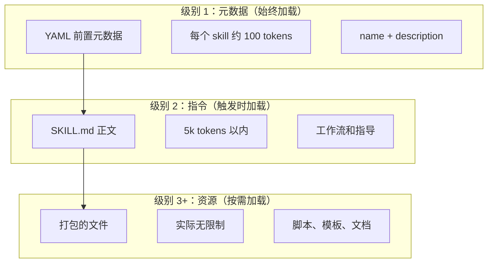
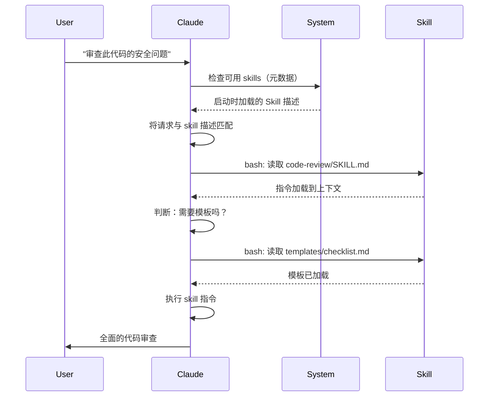

<picture>
  <source media="(prefers-color-scheme: dark)" srcset="../resources/logos/claude-howto-logo-dark.svg">
  
</picture>

# Agent Skills 指南

Agent Skills 是可复用的、基于文件系统的能力扩展，为 Claude 提供特定领域的专业知识、工作流和最佳实践，封装成可发现的组件，Claude 会在相关场景自动使用。

## 概述

**Agent Skills** 是模块化的能力，将通用代理转化为专业 specialists。与 prompts（对话级的一次性任务指令）不同，Skills 按需加载，无需在多个对话中重复提供相同指导。

### 核心优势

- **专业化 Claude**：为特定领域任务定制能力
- **减少重复**：创建一次，自动在多个对话中使用
- **组合能力**：组合多个 Skills 构建复杂工作流
- **扩展工作流**：跨项目和团队复用 skills
- **保持质量**：将最佳实践直接嵌入工作流

Skills 遵循 [Agent Skills](https://agentskills.io) 开放标准，兼容多种 AI 工具。Claude Code 在此标准上扩展了调用控制、子代理执行和动态上下文注入等额外功能。

> **注意**：自定义斜杠命令已合并到 skills 中。`.claude/commands/` 文件仍然有效并支持相同的前置元数据字段。推荐在新开发中使用 Skills。当同一路径同时存在两者时（如 `.claude/commands/review.md` 和 `.claude/skills/review/SKILL.md`），skill 优先。

## Skills 如何工作：渐进式披露

Skills 利用**渐进式披露**架构——Claude 按需分阶段加载信息，而非预先加载全部内容。这实现了高效的上下文管理，同时保持无限的可扩展性。

### 三个加载级别



| 级别 | 加载时机 | Token 消耗 | 内容 |
|-------|------------|------------|---------|
| **级别 1：元数据** | 始终（启动时） | 每个 Skill 约 100 tokens | YAML 前置元数据中的 `name` 和 `description` |
| **级别 2：指令** | Skill 被触发时 | 5k tokens 以内 | SKILL.md 正文，包含指令和指导 |
| **级别 3+：资源** | 按需 | 实际无限制 | 通过 bash 执行打包的文件，内容不加载到上下文中 |

这意味着你可以安装许多 Skills 而不消耗上下文——Claude 只知道每个 Skill 的存在和何时使用它，直到真正被触发。

## Skill 加载流程



## Skill 类型和位置

| 类型 | 位置 | 作用域 | 共享 | 适用场景 |
|------|----------|-------|--------|----------|
| **企业级** | 托管设置 | 所有组织用户 | 是 | 组织范围的标准 |
| **个人级** | `~/.claude/skills/<skill-name>/SKILL.md` | 个人 | 否 | 个人工作流 |
| **项目级** | `.claude/skills/<skill-name>/SKILL.md` | 团队 | 是（通过 git） | 团队标准 |
| **插件** | `<plugin>/skills/<skill-name>/SKILL.md` | 启用位置 | 取决于插件 | 与插件捆绑 |

当多个级别存在同名 skills 时，优先级规则：**企业 > 个人 > 项目**。插件 skills 使用 `plugin-name:skill-name` 命名空间，不会冲突。

### 自动发现

**嵌套目录**：当你处理子目录中的文件时，Claude Code 会自动从嵌套的 `.claude/skills/` 目录发现 skills。例如，如果你在 `packages/frontend/` 中编辑文件，Claude Code 也会在 `packages/frontend/.claude/skills/` 中查找 skills。这支持 packages 拥有自己 skills 的 monorepo 设置。

**`--add-dir` 目录**：通过 `--add-dir` 添加的目录中的 skills 会自动加载，并具有实时变更检测。这些目录中 skill 文件的任何编辑会立即生效，无需重启 Claude Code。

**描述预算**：Skill 描述（级别 1 元数据）上限为**上下文窗口的 2%**（回退值：**16,000 字符**）。如果你安装了很多 skills，部分可能会被排除。运行 `/context` 检查警告。使用 `SLASH_COMMAND_TOOL_CHAR_BUDGET` 环境变量可以覆盖预算。

## 创建自定义 Skills

### 基本目录结构

```
my-skill/
├── SKILL.md           # 主要指令（必需）
├── template.md        # Claude 填充的模板
├── examples/
│   └── sample.md      # 展示预期格式的示例输出
└── scripts/
    └── validate.sh    # Claude 可执行的脚本
```

### SKILL.md 格式

```yaml
---
name: your-skill-name
description: 简要描述此 Skill 的作用及何时使用
---

# Your Skill Name

## Instructions
提供清晰的分步指导给 Claude。

## Examples
展示使用此 Skill 的具体示例。
```

### 必需字段

- **name**：仅小写字母、数字、连字符（最多 64 字符）。不能包含 "anthropic" 或 "claude"。
- **description**：Skill 的作用**以及**何时使用（最多 1024 字符）。这是 Claude 决定何时激活 skill 的关键。

### 可选前置元数据字段

```yaml
---
name: my-skill
description: 此 skill 的作用及何时使用
argument-hint: "[filename] [format]"        # 自动补全提示
disable-model-invocation: true              # 仅用户可调用
user-invocable: false                       # 在斜杠菜单中隐藏
allowed-tools: Read, Grep, Glob             # 限制工具访问
model: opus                                 # 指定使用的模型
effort: high                                # 工作量级别覆盖（low, medium, high, max）
context: fork                               # 在独立子代理中运行
agent: Explore                              # 使用的代理类型（配合 context: fork）
shell: bash                                 # 命令使用的 shell：bash（默认）或 powershell
hooks:                                      # Skill 作用域的钩子
  PreToolUse:
    - matcher: "Bash"
      hooks:
        - type: command
          command: "./scripts/validate.sh"
---
```

| 字段 | 描述 |
|-------|-------------|
| `name` | 仅小写字母、数字、连字符（最多 64 字符）。不能包含 "anthropic" 或 "claude"。 |
| `description` | Skill 的作用**以及**何时使用（最多 1024 字符）。对自动调用匹配至关重要。 |
| `argument-hint` | `/` 自动补全菜单中显示的提示（如 `"[filename] [format]"`）。 |
| `disable-model-invocation` | `true` = 仅用户可通过 `/name` 调用。Claude 不会自动调用。 |
| `user-invocable` | `false` = 在 `/` 菜单中隐藏。只有 Claude 可以自动调用。 |
| `allowed-tools` | Skill 可使用而不提示权限的工具列表，逗号分隔。 |
| `model` | Skill 激活时的模型覆盖（如 `opus`、`sonnet`）。 |
| `effort` | Skill 激活时的工作量级别覆盖：`low`、`medium`、`high` 或 `max`。 |
| `context` | `fork` 可以在独立子代理上下文中运行 skill，拥有自己的上下文窗口。 |
| `agent` | `context: fork` 时的子代理类型（如 `Explore`、`Plan`、`general-purpose`）。 |
| `shell` | `` !`command` `` 替换和脚本使用的 shell：`bash`（默认）或 `powershell`。 |
| `hooks` | 绑定到此 skill 生命周期的钩子（格式与全局钩子相同）。 |

## Skill 内容类型

Skills 可以包含两种类型的内容，各适用于不同场景：

### 参考内容

为 Claude 提供应用于当前工作的知识——约定、模式、风格指南、领域知识。与对话上下文一起内联运行。

```yaml
---
name: api-conventions
description: 此代码库的 API 设计模式
---

编写 API 端点时：
- 使用 RESTful 命名约定
- 返回一致的错误格式
- 包含请求验证
```

### 任务内容

特定操作的分步指令。通常直接用 `/skill-name` 调用。

```yaml
---
name: deploy
description: 将应用部署到生产环境
context: fork
disable-model-invocation: true
---

部署应用：
1. 运行测试套件
2. 构建应用
3. 推送到部署目标
```

## 控制 Skill 调用

默认情况下，你和 Claude 都可以调用任何 skill。两个前置元数据字段控制三种调用模式：

| 前置元数据 | 你可以调用 | Claude 可以调用 |
|---|---|---|
| （默认） | 是 | 是 |
| `disable-model-invocation: true` | 是 | 否 |
| `user-invocable: false` | 否 | 是 |

**使用 `disable-model-invocation: true`** 用于有副作用的工作流：`/commit`、`/deploy`、`/send-slack-message`。你不会想让 Claude 因为你的代码看起来准备好了就决定部署。

**使用 `user-invocable: false`** 用于用户不可作为命令执行的背景知识。`legacy-system-context` skill 解释旧系统的工作方式——对 Claude 有用，但对用户来说不是有意义的操作。

## 字符串替换

Skills 支持动态值，在 skill 内容到达 Claude 之前解析：

| 变量 | 描述 |
|----------|-------------|
| `$ARGUMENTS` | 调用 skill 时传递的所有参数 |
| `$ARGUMENTS[N]` 或 `$N` | 按索引访问特定参数（从 0 开始） |
| `${CLAUDE_SESSION_ID}` | 当前会话 ID |
| `${CLAUDE_SKILL_DIR}` | 包含 skill 的 SKILL.md 文件的目录 |
| `` !`command` `` | 动态上下文注入——运行 shell 命令并将输出内联 |

**示例：**

```yaml
---
name: fix-issue
description: 修复 GitHub issue
---

修复 GitHub issue $ARGUMENTS，遵循我们的编码标准。
1. 阅读 issue 描述
2. 实现修复
3. 编写测试
4. 创建提交
```

运行 `/fix-issue 123` 会将 `$ARGUMENTS` 替换为 `123`。

## 注入动态上下文

`` !`command` `` 语法在 skill 内容发送到 Claude 之前运行 shell 命令：

```yaml
---
name: pr-summary
description: 总结 Pull Request 的更改
context: fork
agent: Explore
---

## Pull Request 上下文
- PR diff: !`gh pr diff`
- PR 评论: !`gh pr view --comments`
- 变更文件: !`gh pr diff --name-only`

## 你的任务
总结此 Pull Request...
```

命令立即执行；Claude 只看到最终输出。默认情况下，命令在 `bash` 中运行。在前置元数据中设置 `shell: powershell` 可改用 PowerShell。

## 在子代理中运行 Skills

添加 `context: fork` 以在独立子代理上下文中运行 skill。Skill 内容成为专用子代理的任务，拥有自己的上下文窗口，保持主对话整洁。

`agent` 字段指定使用的代理类型：

| 代理类型 | 适用场景 |
|---|---|
| `Explore` | 只读研究、代码库分析 |
| `Plan` | 创建实现计划 |
| `general-purpose` | 需要所有工具的广泛任务 |
| 自定义代理 | 配置中定义的专业代理 |

**示例前置元数据：**

```yaml
---
context: fork
agent: Explore
---
```

**完整 skill 示例：**

```yaml
---
name: deep-research
description: 彻底研究一个主题
context: fork
agent: Explore
---

彻底研究 $ARGUMENTS：
1. 使用 Glob 和 Grep 查找相关文件
2. 阅读和分析代码
3. 总结发现，包含具体文件引用
```

## 实践示例

### 示例 1：代码审查 Skill

**目录结构：**

```
~/.claude/skills/code-review/
├── SKILL.md
├── templates/
│   ├── review-checklist.md
│   └── finding-template.md
└── scripts/
    ├── analyze-metrics.py
    └── compare-complexity.py
```

**文件：** `~/.claude/skills/code-review/SKILL.md`

```yaml
---
name: code-review-specialist
description: 全面的代码审查，包含安全、性能和质量分析。当用户要求审查代码、分析代码质量、评估 Pull Request，或提及代码审查、安全分析、性能优化时使用。
---

# Code Review Skill

此 skill 提供全面的代码审查能力，重点关注：

1. **安全分析**
   - 认证/授权问题
   - 数据暴露风险
   - 注入漏洞
   - 加密弱点

2. **性能审查**
   - 算法效率（Big O 分析）
   - 内存优化
   - 数据库查询优化
   - 缓存机会

3. **代码质量**
   - SOLID 原则
   - 设计模式
   - 命名约定
   - 测试覆盖率

4. **可维护性**
   - 代码可读性
   - 函数大小（应小于 50 行）
   - 圈复杂度
   - 类型安全

## 审查模板

对于审查的每段代码，提供：

### 摘要
- 整体质量评估（1-5）
- 主要发现数量
- 推荐优先领域

### 关键问题（如有）
- **问题**：清晰描述
- **位置**：文件和行号
- **影响**：为什么重要
- **严重性**：Critical/High/Medium
- **修复**：代码示例

详细检查清单见 [templates/review-checklist.md](templates/review-checklist.md)。
```

### 示例 2：代码库可视化 Skill

生成交互式 HTML 可视化的 skill：

**目录结构：**

```
~/.claude/skills/codebase-visualizer/
├── SKILL.md
└── scripts/
    └── visualize.py
```

**文件：** `~/.claude/skills/codebase-visualizer/SKILL.md`

```yaml
---
name: codebase-visualizer
description: 生成代码库的交互式可折叠树状可视化。在探索新仓库、理解项目结构或识别大文件时使用。
allowed-tools: Bash(python *)
---

# Codebase Visualizer

生成显示项目文件结构的交互式 HTML 树视图。

## 使用方法

从项目根目录运行可视化脚本：

```bash
python ~/.claude/skills/codebase-visualizer/scripts/visualize.py .
```

这会创建 `codebase-map.html` 并在默认浏览器中打开。

## 可视化内容

- **可折叠目录**：点击文件夹展开/折叠
- **文件大小**：显示在每个文件旁边
- **颜色**：不同文件类型不同颜色
- **目录总计**：显示每个文件夹的总大小
```

打包的 Python 脚本做重活，Claude 负责编排。

### 示例 3：部署 Skill（仅用户调用）

```yaml
---
name: deploy
description: 将应用部署到生产环境
disable-model-invocation: true
allowed-tools: Bash(npm *), Bash(git *)
---

将 $ARGUMENTS 部署到生产环境：

1. 运行测试套件：`npm test`
2. 构建应用：`npm run build`
3. 推送到部署目标
4. 验证部署成功
5. 报告部署状态
```

### 示例 4：品牌声音 Skill（背景知识）

```yaml
---
name: brand-voice
description: 确保所有沟通符合品牌声音和语调指南。在创建营销文案、客户沟通或面向公众的内容时使用。
user-invocable: false
---

## 语调
- **友好但专业** - 平易近人但不随意
- **清晰简洁** - 避免术语
- **自信** - 我们知道自己在做什么
- **有同理心** - 理解用户需求

## 写作指南
- 用"你"称呼读者
- 使用主动语态
- 句子保持在 20 字以内
- 从价值主张开始

模板见 [templates/](templates/)。
```

### 示例 5：CLAUDE.md 生成器 Skill

```yaml
---
name: claude-md
description: 按照最佳实践创建或更新 CLAUDE.md 文件，实现最佳的 AI 代理 onboarding。当用户提及 CLAUDE.md、项目文档或 AI onboarding 时使用。
---

## 核心原则

**LLM 是无状态的**：CLAUDE.md 是每个对话自动包含的唯一文件。

### 黄金法则

1. **少即是多**：保持在 300 行以内（最好 100 行以内）
2. **普遍适用性**：只包含与每个会话相关的信息
3. **不要用 Claude 作为 Linter**：使用确定性工具代替
4. **绝不自动生成**：手工精心制作，考虑清楚

## 必需部分

- **项目名称**：简短的一行描述
- **技术栈**：主要语言、框架、数据库
- **开发命令**：安装、测试、构建命令
- **关键约定**：仅限不明显的、高影响的约定
- **已知问题/陷阱**：容易绊倒开发者的内容
```

### 示例 6：重构 Skill（含脚本）

**目录结构：**

```
refactor/
├── SKILL.md
├── references/
│   ├── code-smells.md
│   └── refactoring-catalog.md
├── templates/
│   └── refactoring-plan.md
└── scripts/
    ├── analyze-complexity.py
    └── detect-smells.py
```

**文件：** `refactor/SKILL.md`

```yaml
---
name: code-refactor
description: 基于 Martin Fowler 方法论的系统性代码重构。当用户要求重构代码、改进代码结构、减少技术债务或消除代码味道时使用。
---

# Code Refactoring Skill

强调由测试支持的、安全的、增量变更的分阶段方法。

## 工作流

阶段 1：研究与分析 → 阶段 2：测试覆盖率评估 →
阶段 3：代码味道识别 → 阶段 4：重构计划创建 →
阶段 5：增量实现 → 阶段 6：审查与迭代

## 核心原则

1. **行为保持**：外部行为必须保持不变
2. **小步前进**：做小的、可测试的变更
3. **测试驱动**：测试是安全网
4. **持续进行**：重构是持续进行的，不是一次性事件

代码味道目录见 [references/code-smells.md](references/code-smells.md)。
重构技术见 [references/refactoring-catalog.md](references/refactoring-catalog.md)。
```

## 支持文件

Skills 可以在 `SKILL.md` 所在目录包含多个文件。这些支持文件（模板、示例、脚本、参考文档）让你保持主 skill 文件聚焦，同时为 Claude 提供按需加载的额外资源。

```
my-skill/
├── SKILL.md              # 主要指令（必需，保持 500 行以内）
├── templates/            # Claude 填充的模板
│   └── output-format.md
├── examples/             # 展示预期格式的示例输出
│   └── sample-output.md
├── references/           # 领域知识和规格说明
│   └── api-spec.md
└── scripts/              # Claude 可执行的脚本
    └── validate.sh
```

支持文件指南：

- 保持 `SKILL.md` 在 **500 行以内**。将详细的参考资料、大型示例和规格说明移到单独的文件。
- 使用**相对路径**从 `SKILL.md` 引用额外文件（如 `[API 参考](references/api-spec.md)`）。
- 支持文件在级别 3 加载（按需），因此在 Claude 实际读取之前不消耗上下文。

## 管理 Skills

### 查看可用 Skills

直接问 Claude：
```
What Skills are available?
```

或检查文件系统：
```bash
# 列出个人 Skills
ls ~/.claude/skills/

# 列出项目 Skills
ls .claude/skills/
```

### 测试 Skill

两种测试方式：

**让 Claude 自动调用**，询问匹配描述的内容：
```
Can you help me review this code for security issues?
```

**或直接调用** skill 名称：
```
/code-review src/auth/login.ts
```

### 更新 Skill

直接编辑 `SKILL.md` 文件。更改在下次 Claude Code 启动时生效。

```bash
# 个人 Skill
code ~/.claude/skills/my-skill/SKILL.md

# 项目 Skill
code .claude/skills/my-skill/SKILL.md
```

### 限制 Claude 的 Skill 访问

三种控制 Claude 可以调用哪些 skills 的方式：

**在 `/permissions` 中禁用所有 skills**：
```
# 添加到拒绝规则：
Skill
```

**允许或拒绝特定 skills**：
```
# 仅允许特定 skills
Skill(commit)
Skill(review-pr *)

# 拒绝特定 skills
Skill(deploy *)
```

**通过在前置元数据中添加 `disable-model-invocation: true` 隐藏单个 skills**。

## 最佳实践

### 1. 使描述具体化

- **差（模糊）**："帮助处理文档"
- **好（具体）**："从 PDF 文件提取文本和表格，填写表单，合并文档。在处理 PDF 文件或用户提及 PDF、表单或文档提取时使用。"

### 2. 保持 Skills 聚焦

- 一个 Skill = 一种能力
- ✅ "PDF 表单填写"
- ❌ "文档处理"（太宽泛）

### 3. 包含触发词

在描述中添加用户自然会说出的关键词：
```yaml
description: 分析 Excel 电子表格，生成透视表，创建图表。在处理 Excel 文件、电子表格或 .xlsx 文件时使用。
```

### 4. 保持 SKILL.md 在 500 行以内

将详细参考资料移到 Claude 按需加载的单独文件。

### 5. 引用支持文件

```markdown
## 额外资源

- 完整 API 详情见 [reference.md](reference.md)
- 使用示例见 [examples.md](examples.md)
```

### 应该做

- 使用清晰、描述性的名称
- 包含全面的指令
- 添加具体示例
- 打包相关脚本和模板
- 用真实场景测试
- 记录依赖

### 不应该做

- 不要为一次性任务创建 skills
- 不要复制现有功能
- 不要让 skills 太宽泛
- 不要跳过描述字段
- 在审计前不要使用来自不可信来源的 skills

## 故障排查

### 快速参考

| 问题 | 解决方案 |
|-------|----------|
| Claude 不使用 Skill | 使描述更具体，包含触发词 |
| Skill 文件未找到 | 验证路径：`~/.claude/skills/name/SKILL.md` |
| YAML 错误 | 检查 `---` 标记、缩进、不使用 Tab |
| Skills 冲突 | 在描述中使用不同的触发词 |
| 脚本不运行 | 检查权限：`chmod +x scripts/*.py` |
| Claude 看不到所有 skills | Skills 太多；检查 `/context` 警告 |

### Skill 未触发

如果 Claude 在预期时未使用你的 skill：

1. 检查描述包含用户会自然说出的关键词
2. 验证在问"What skills are available?"时 skill 出现
3. 尝试重新表述请求以匹配描述
4. 直接用 `/skill-name` 调用测试

### Skill 触发过于频繁

如果 Claude 在不需要时使用了你的 skill：

1. 使描述更具体
2. 对于手动调用，添加 `disable-model-invocation: true`

### Claude 看不到所有 Skills

Skill 描述在**上下文窗口的 2%** 加载（回退值：**16,000 字符**）。运行 `/context` 检查关于排除的 skills 的警告。使用 `SLASH_COMMAND_TOOL_CHAR_BUDGET` 环境变量可以覆盖预算。

## 安全注意事项

**仅使用来自可信来源的 Skills。** Skills 通过指令和代码为 Claude 提供能力——恶意 Skill 可以指示 Claude 以有害方式调用工具或执行代码。

**关键安全考虑：**

- **彻底审计**：审查 Skill 目录中的所有文件
- **外部来源有风险**：从外部 URL 获取的 Skills 可能会被篡改
- **工具滥用**：恶意 Skills 可以有害方式调用工具
- **像安装软件一样对待**：仅使用来自可信来源的 Skills

## Skills 与其他功能的对比

| 功能 | 调用方式 | 适用场景 |
|---------|------------|----------|
| **Skills** | 自动或 `/name` | 可复用的专业知识、工作流 |
| **斜杠命令** | 用户发起的 `/name` | 快速快捷方式（已合并到 skills） |
| **子代理** | 自动委托 | 隔离任务执行 |
| **内存（CLAUDE.md）** | 始终加载 | 持久项目上下文 |
| **MCP** | 实时 | 外部数据/服务访问 |
| **Hooks** | 事件驱动 | 自动副作用 |

## 捆绑 Skills

Claude Code 附带多个内置 skills，无需安装即可使用：

| Skill | 描述 |
|-------|-------------|
| `/simplify` | 审查变更文件以实现复用、质量和效率；生成 3 个并行审查代理 |
| `/batch <instruction>` | 使用 git worktrees 跨代码库编排大规模并行变更 |
| `/debug [description]` | 通过读取调试日志排查当前会话问题 |
| `/loop [interval] <prompt>` | 按间隔重复运行提示（如 `/loop 5m check the deploy`） |
| `/claude-api` | 加载 Claude API/SDK 参考；在 `anthropic`/`@anthropic-ai/sdk` 导入时自动激活 |

这些 skills 开箱即用，无需安装或配置。它们遵循与自定义 skills 相同的 SKILL.md 格式。

## 分享 Skills

### 项目 Skills（团队共享）

1. 在 `.claude/skills/` 创建 Skill
2. 提交到 git
3. 团队成员拉取更改——Skills 立即可用

### 个人 Skills

```bash
# 复制到个人目录
cp -r my-skill ~/.claude/skills/

# 使脚本可执行
chmod +x ~/.claude/skills/my-skill/scripts/*.py
```

### 插件分发

在插件的 `skills/` 目录中打包 skills 以便更广泛分发。

## 深入学习：Skill 集合和 Skill 管理器

一旦你开始认真构建 skills，有两件事变得必不可少：一个经过验证的 skills 库和一个管理它们的工具。

**[luongnv89/skills](https://github.com/luongnv89/skills)** — 我日常在几乎所有项目中使用的 skills 集合。其中亮点包括 `logo-designer`（动态生成项目 logo）和 `ollama-optimizer`（为你的硬件调优本地 LLM 性能）。如果你想要现成的 skills，这是很好的起点。

**[luongnv89/asm](https://github.com/luongnv89/asm)** — Agent Skill Manager。处理 skill 开发、重复检测和测试。`asm link` 命令让你在任何项目中测试 skill 而无需复制文件——一旦你有了十几个 skills，这就变得必不可少。

## 额外资源

- [官方 Skills 文档](https://code.claude.com/docs/en/skills)
- [Agent Skills 架构博客](https://claude.com/blog/equipping-agents-for-the-real-world-with-agent-skills)
- [Skills 仓库](https://github.com/luongnv89/skills) - 现成可用的 skills 集合
- [斜杠命令指南](../01-slash-commands/) - 用户发起的快捷方式
- [子代理指南](../04-subagents/) - 委托的 AI 代理
- [内存指南](../02-memory/) - 持久上下文
- [MCP（模型上下文协议）](../05-mcp/) - 实时外部数据
- [Hooks 指南](../06-hooks/) - 事件驱动的自动化
