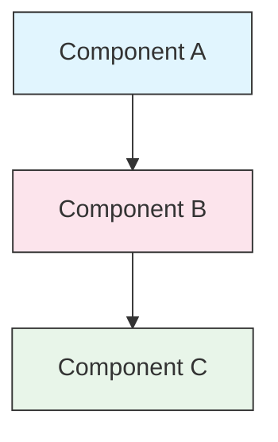

<picture>
  <source media="(prefers-color-scheme: dark)" srcset="resources/logos/claude-howto-logo-dark.svg">
  
</picture>

# 风格指南

> 为 Claude How To 贡献的约定和格式规则。遵循本指南以保持内容一致、专业且易于维护。

---

## 目录

- [文件和文件夹命名](#文件和文件夹命名)
- [文档结构](#文档结构)
- [标题](#标题)
- [文本格式](#文本格式)
- [列表](#列表)
- [表格](#表格)
- [代码块](#代码块)
- [链接和交叉引用](#链接和交叉引用)
- [图表](#图表)
- [表情符号使用](#表情符号使用)
- [YAML Frontmatter](#yaml-frontmatter)
- [图片和媒体](#图片和媒体)
- [语气和语调](#语气和语调)
- [提交消息](#提交消息)
- [作者检查清单](#作者检查清单)

---

## 文件和文件夹命名

### 课程文件夹

课程文件夹使用**两位数字前缀**后跟**kebab-case**描述符：

```
01-slash-commands/
02-memory/
03-skills/
04-subagents/
05-mcp/
```

数字反映了从初学者到高级的学习路径顺序。

### 文件名

| 类型 | 约定 | 示例 |
|------|-----------|----------|
| **课程 README** | `README.md` | `01-slash-commands/README.md` |
| **功能文件** | Kebab-case `.md` | `code-reviewer.md`、`generate-api-docs.md` |
| **Shell 脚本** | Kebab-case `.sh` | `format-code.sh`、`validate-input.sh` |
| **配置文件** | 标准名称 | `.mcp.json`、`settings.json` |
| **记忆文件** | 范围前缀 | `project-CLAUDE.md`、`personal-CLAUDE.md` |
| **顶级文档** | UPPER_CASE `.md` | `CATALOG.md`、`QUICK_REFERENCE.md`、`CONTRIBUTING.md` |
| **图片资源** | Kebab-case | `pr-slash-command.png`、`claude-howto-logo.svg` |

### 规则

- 所有文件和文件夹名称使用**小写**（顶级文档如 `README.md`、`CATALOG.md` 除外）
- 使用**连字符**（`-`）作为单词分隔符，切勿使用下划线或空格
- 保持名称描述性但简洁

---

## 文档结构

### 根 README

根 `README.md` 按以下顺序：

1. Logo（带有深色/浅色变体的 `<picture>` 元素）
2. H1 标题
3. 简介块引用（一句话价值主张）
4. "为什么选择本指南？"部分，包含比较表
5. 水平线（`---`）
6. 目录
7. 功能目录
8. 快速导航
9. 学习路径
10. 功能部分
11. 入门指南
12. 最佳实践/故障排除
13. 贡献/许可证

### 课程 README

每个课程 `README.md` 按以下顺序：

1. H1 标题（例如 `# Slash Commands`）
2. 简要概述段落
3. 快速参考表（可选）
4. 架构图（Mermaid）
5. 详细部分（H2）
6. 实用示例（编号，4-6 个示例）
7. 最佳实践（注意事项表）
8. 故障排除
9. 相关指南/官方文档
10. 文档元数据页脚

### 功能/示例文件

单个功能文件（例如 `optimize.md`、`pr.md`）：

1. YAML frontmatter（如果适用）
2. H1 标题
3. 目的/描述
4. 使用说明
5. 代码示例
6. 自定义提示

### 章节分隔符

使用水平线（`---`）分隔文档的主要区域：

```markdown
---

## 新主要章节
```

在简介块引用之后以及文档逻辑上不同部分之间放置它们。

---

## 标题

### 层级

| 级别 | 用途 | 示例 |
|-------|-----|---------|
| `#` H1 | 页面标题（每个文档一个） | `# Slash Commands` |
| `##` H2 | 主要章节 | `## Best Practices` |
| `###` H3 | 子章节 | `### Adding a Skill` |
| `####` H4 | 子子章节（很少） | `#### Configuration Options` |

### 规则

- **每个文档一个 H1** - 仅页面标题
- **永不跳过级别** - 不要从 H2 跳到 H4
- **保持标题简洁** - 目标 2-5 个单词
- **使用句子大小写** - 仅大写第一个单词和专有名词（例外：功能名称保持原样）
- **仅在根 README 章节标题上添加表情符号前缀**（参见[表情符号使用](#表情符号使用)）

---

## 文本格式

### 强调

| 样式 | 何时使用 | 示例 |
|-------|------------|---------|
| **粗体**（`**text**`） | 关键术语、表中的标签、重要概念 | `**Installation**：` |
| *斜体*（`*text*`） | 技术术语的首次使用、书/文档标题 | `*frontmatter*` |
| `Code`（`` `text` ``） | 文件名、命令、配置值、代码引用 | `` `CLAUDE.md` `` |

### 用于提示的块引用

使用带有粗体前缀的块引用来表示重要说明：

```markdown
> **Note**：自定义斜杠命令自 v2.0 起已合并到 skills。
>
> **Important**：永不提交 API 密钥或凭据。
>
> **Tip**：将 memory 与 skills 结合使用以获得最大效果。
```

支持的提示类型：**Note**、**Important**、**Tip**、**Warning**。

### 段落

- 保持段落短（2-4 句）
- 段落之间添加空行
- 首先提出关键点，然后提供上下文
- 解释"为什么"而不仅是"是什么"

---

## 列表

### 无序列表

使用连字符（`-`）和 2 空格缩进进行嵌套：

```markdown
- 第一个项目
- 第二个项目
  - 嵌套项目
  - 另一个嵌套项目
    - 深度嵌套（避免超过 3 层）
- 第三个项目
```

### 有序列表

对顺序步骤、说明和排名项目使用编号列表：

```markdown
1. 第一步
2. 第二步
   - 子点详情
   - 另一个子点
3. 第三步
```

### 描述列表

对键值样式列表使用粗体标签：

```markdown
- **性能瓶颈** - 识别 O(n^2) 操作、低效循环
- **内存泄漏** - 查找未释放的资源、循环引用
- **算法改进** - 建议更好的算法或数据结构
```

### 规则

- 保持一致的缩进（每级 2 个空格）
- 在列表之前和之后添加空行
- 保持列表项目结构平行（都以动词开头，或都是名词等）
- 避免嵌套超过 3 层

---

## 表格

### 标准格式

```markdown
| 第 1 列 | 第 2 列 | 第 3 列 |
|----------|----------|----------|
| 数据     | 数据     | 数据     |
```

### 常见表格模式

**功能比较（3-4 列）：**

```markdown
| Feature | Invocation | Persistence | Best For |
|---------|-----------|------------|----------|
| **Slash Commands** | Manual (`/cmd`) | Session only | Quick shortcuts |
| **Memory** | Auto-loaded | Cross-session | Long-term learning |
```

**注意事项：**

```markdown
| Do | Don't |
|----|-------|
| Use descriptive names | Use vague names |
| Keep files focused | Overload a single file |
```

**快速参考：**

```markdown
| Aspect | Details |
|--------|---------|
| **Purpose** | Generate API documentation |
| **Scope** | Project-level |
| **Complexity** | Intermediate |
```

### 规则

- 当它们是行标签（第一列）时**粗体表格标题**
- 为可读性对齐管道（可选但首选）
- 保持单元格内容简洁；使用链接获取详情
- 在单元格内使用 `code formatting` 表示命令和文件路径

---

## 代码块

### 语言标签

始终指定语言标签以进行语法高亮：

| 语言 | 标签 | 用于 |
|----------|-----|---------|
| Shell | `bash` | CLI 命令、脚本 |
| Python | `python` | Python 代码 |
| JavaScript | `javascript` | JS 代码 |
| TypeScript | `typescript` | TS 代码 |
| JSON | `json` | 配置文件 |
| YAML | `yaml` | Frontmatter、配置 |
| Markdown | `markdown` | Markdown 示例 |
| SQL | `sql` | 数据库查询 |
| 纯文本 | （无标签） | 预期输出、目录树 |

### 约定

```bash
# 解释命令作用的注释
claude mcp add notion --transport http https://mcp.notion.com/mcp
```

- 在非显而易见命令之前添加**注释行**
- 使所有示例**可复制粘贴**
- 必要时展示**简单和高级**版本
- 当有助于理解时包含**预期输出**（使用无标签代码块）

### 安装块

对此模式使用安装说明：

```bash
# 将文件复制到您的项目
cp 01-slash-commands/*.md .claude/commands/
```

### 多步骤工作流

```bash
# 步骤 1：创建目录
mkdir -p .claude/commands

# 步骤 2：复制模板
cp 01-slash-commands/*.md .claude/commands/

# 步骤 3：验证安装
ls .claude/commands/
```

---

## 链接和交叉引用

### 内部链接（相对）

对所有内部链接使用相对路径：

```markdown
[Slash Commands](01-slash-commands/)
[Skills Guide](03-skills/)
[Memory Architecture](02-memory/#memory-architecture)
```

从课程文件夹返回根目录或同级：

```markdown
[返回主指南](../README.md)
[相关：Skills](../03-skills/)
```

### 外部链接（绝对）

使用带有描述性锚文本的完整 URL：

```markdown
[Anthropic's official documentation](https://code.claude.com/docs/en/overview)
```

- 永不使用"点击这里"或"此链接"作为锚文本
- 使用在上下文中合理的描述性文本

### 章节锚点

使用 GitHub 风格的锚点链接到同一文档内的章节：

```markdown
[Feature Catalog](#-feature-catalog)
[Best Practices](#best-practices)
```

### 相关指南模式

在课程结尾添加相关指南部分：

```markdown
## Related Guides

- [Slash Commands](../01-slash-commands/) - Quick shortcuts
- [Memory](../02-memory/) - Persistent context
- [Skills](../03-skills/) - Reusable capabilities
```

---

## 图表

### Mermaid

对所有图表使用 Mermaid。支持的类型：

- `graph TB` / `graph LR` — 架构、层级、流程
- `sequenceDiagram` — 交互流程
- `timeline` — 时间顺序

### 样式约定

使用样式块应用一致的颜色：



**调色板：**

| 颜色 | 十六进制 | 用于 |
|-------|-----|---------|
| 浅蓝 | `#e1f5fe` | 主要组件、输入 |
| 浅粉 | `#fce4ec` | 处理、中间件 |
| 浅绿 | `#e8f5e9` | 输出、结果 |
| 浅黄 | `#fff9c4` | 配置、可选 |
| 浅紫 | `#f3e5f5` | 用户界面、UI |

### 规则

- 使用 `["Label text"]` 表示节点标签（支持特殊字符）
- 使用 `<br/>` 在标签内换行
- 保持图表简单（最多 10-12 个节点）
- 在图表下方添加简要文本描述以提高可访问性
- 对层级使用自上而下（`TB`），对工作流使用从左到右（`LR`）

---

## 表情符号使用

### 使用表情符号的位置

表情符号**谨慎且有目的地**使用 - 仅在特定上下文中：

| 上下文 | 表情符号 | 示例 |
|---------|--------|---------|
| 根 README 章节标题 | 类别图标 | `## 📚 Learning Path` |
| 技能级别指示器 | 彩色圆圈 | 🟢 初级、🔵 中级、🔴 高级 |
| 注意事项 | 勾/叉标记 | ✅ 这样做、❌ 不要这样做 |
| 复杂度评分 | 星号 | ⭐⭐⭐ |

### 标准表情符号集

| 表情符号 | 含义 |
|---------|---------|
| 📚 | 学习、指南、文档 |
| ⚡ | 入门、快速参考 |
| 🎯 | 功能、快速参考 |
| 🎓 | 学习路径 |
| 📊 | 统计、比较 |
| 🚀 | 安装、快速命令 |
| 🟢 | 初级级别 |
| 🔵 | 中级级别 |
| 🔴 | 高级级别 |
| ✅ | 推荐做法 |
| ❌ | 避免/反模式 |
| ⭐ | 复杂度评分单位 |

### 规则

- **永不将表情符号用于正文文本**或段落
- **仅在根 README 上将表情符号用于标题**（不在课程 README 中）
- **不要添加装饰性表情符号** - 每个表情符号都应该传达含义
- 保持表情符号使用与上表一致

---

## YAML Frontmatter

### 功能文件（Skills、Commands、Agents）

```yaml
---
name: unique-identifier
description: What this feature does and when to use it
allowed-tools: Bash, Read, Grep
---
```

### 可选字段

```yaml
---
name: my-feature
description: Brief description
argument-hint: "[file-path] [options]"
allowed-tools: Bash, Read, Grep, Write, Edit
model: opus                        # opus, sonnet, or haiku
disable-model-invocation: true     # User-only invocation
user-invocable: false              # Hidden from user menu
context: fork                      # Run in isolated subagent
agent: Explore                     # Agent type for context: fork
---
```

### 规则

- 将 frontmatter 放在文件最顶部
- 对 `name` 字段使用 **kebab-case**
- 将 `description` 保持在一句话
- 仅包含需要的字段

---

## 图片和媒体

### Logo 模式

所有以 logo 开头的文档使用 `<picture>` 元素支持深色/浅色模式：

```html
<picture>
  <source media="(prefers-color-scheme: dark)" srcset="resources/logos/claude-howto-logo-dark.svg">
  
</picture>
```

### 截图

- 存储在相关课程文件夹中（例如 `01-slash-commands/pr-slash-command.png`）
- 使用 kebab-case 文件名
- 包含描述性 alt 文本
- 对图表使用 SVG，对截图使用 PNG

### 规则

- 始终为图片提供 alt 文本
- 保持图片文件大小合理（PNG < 500KB）
- 对图片引用使用相对路径
- 将图片存储在与引用它的文档相同的目录中，或对共享图片存储在 `assets/`

---

## 语气和语调

### 写作风格

- **专业但平易近人** - 技术准确但不堆积术语
- **主动语态** - "Create a file" 而非 "A file should be created"
- **直接说明** - "Run this command" 而非 "You might want to run this command"
- **对初学者友好** - 假设读者是 Claude Code 新手，而非编程新手

### 内容原则

| 原则 | 示例 |
|-----------|---------|
| **展示，不要说教** | 提供可工作的示例，而非抽象描述 |
| **渐进式复杂度** | 从简单开始，在后续章节中增加深度 |
| **解释"为什么"** | "Use memory for... because..." 而非仅 "Use memory for..." |
| **可复制粘贴** | 每个代码块都应该可以直接粘贴使用 |
| **真实世界上下文** | 使用实际场景，而非人为示例 |

### 词汇

- 使用"Claude Code"（而非"Claude CLI"或"the tool"）
- 使用"skill"（而非"custom command" - 旧术语）
- 对编号章节使用"lesson"或"guide"
- 对单个功能文件使用"example"

---

## 提交消息

遵循 [Conventional Commits](https://www.conventionalcommits.org/)：

```
type(scope): description
```

### 类型

| Type | 用于 |
|------|---------|
| `feat` | 新功能、示例或指南 |
| `fix` | Bug 修复、修正、断链 |
| `docs` | 文档改进 |
| `refactor` | 重构而不改变行为 |
| `style` | 仅格式更改 |
| `test` | 测试添加或更改 |
| `chore` | 构建、依赖、CI |

### 范围

使用课程名称或文件区域作为范围：

```
feat(slash-commands): Add API documentation generator
docs(memory): Improve personal preferences example
fix(README): Correct table of contents link
docs(skills): Add comprehensive code review skill
```

---

## 文档元数据页脚

课程 README 以元数据块结尾：

```markdown
---
**Last Updated**: March 2026
**Claude Code Version**: 2.1+
**Compatible Models**: Claude Sonnet 4.6, Claude Opus 4.6, Claude Haiku 4.5
```

- 使用月份 + 年份格式（例如"March 2026"）
- 当功能更改时更新版本
- 列出所有兼容的模型

---

## 作者检查清单

提交内容前验证：

- [ ] 文件/文件夹名称使用 kebab-case
- [ ] 文档以 H1 标题开头（每个文件一个）
- [ ] 标题层级正确（无跳级别）
- [ ] 所有代码块都有语言标签
- [ ] 代码示例可复制粘贴
- [ ] 内部链接使用相对路径
- [ ] 外部链接有描述性锚文本
- [ ] 表格格式正确
- [ ] 表情符号遵循标准集（如有使用）
- [ ] Mermaid 图表使用标准调色板
- [ ] 无敏感信息（API 密钥、凭据）
- [ ] YAML frontmatter 有效（如适用）
- [ ] 图片有 alt 文本
- [ ] 段落短小集中
- [ ] 相关指南部分链接到相关课程
- [ ] 提交消息遵循约定式提交格式
